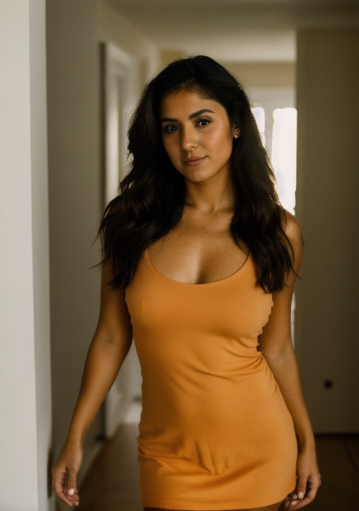

# Realistic-Vision-v5.0-OpenPose Cog model

This is an implementation of the [SG161222/Realistic_Vision_V5.0_noVAE](https://huggingface.co/SG161222/Realistic_Vision_V5.0_noVAE) with OpenPose as a Cog model. [Cog packages machine learning models as standard containers.](https://github.com/replicate/cog)

First, download the pre-trained weights:

    cog run script/download-weights

Then, you can run predictions:

    cog predict -i image=@pose.jpg -i prompt="RAW photo, a portrait photo of a latina woman in a casual dress, 8k uhd, high quality, film grain, Fujifilm XT3" -i seed=1337

## Example

Output:

